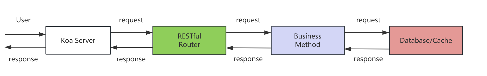
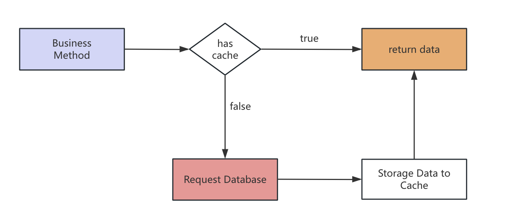
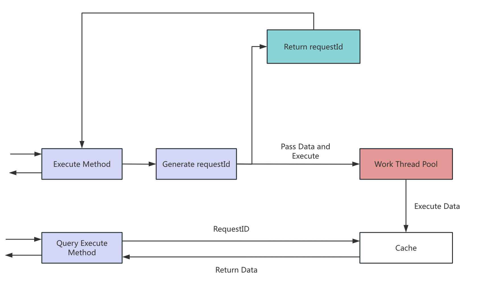
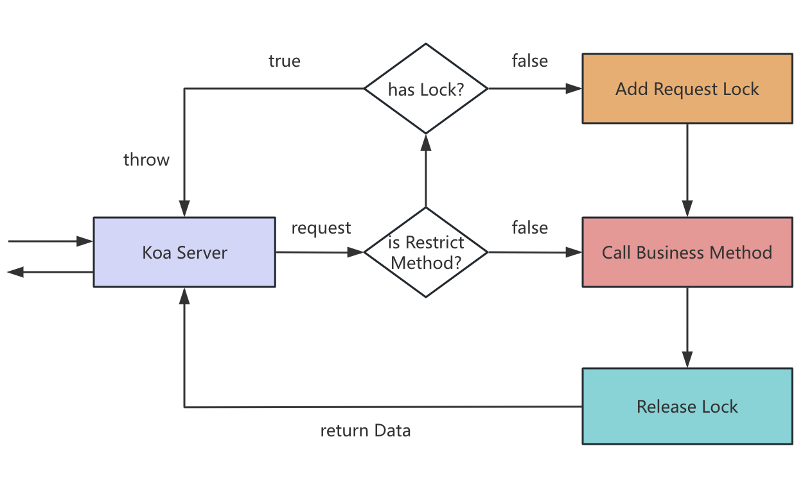
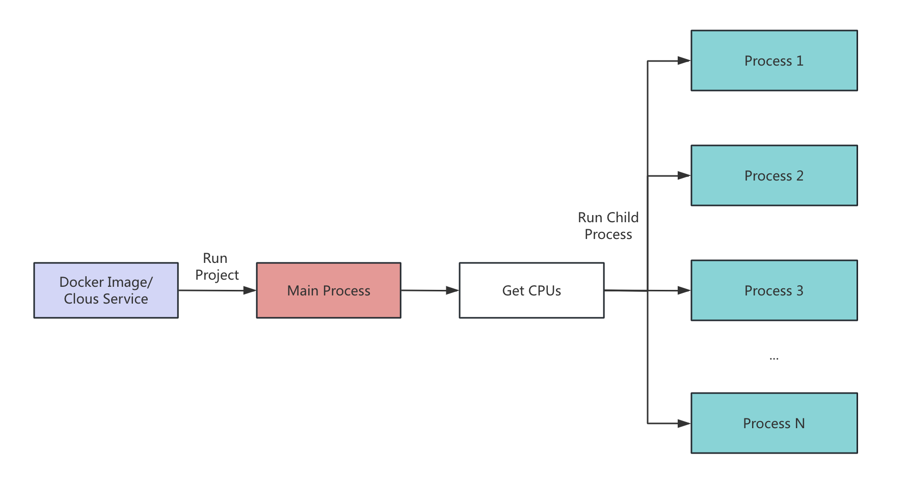

## Project Information

- Project Name: Webhook management server

- Project Description:

- Requirements:

  - support CRUD operations for managing webhooks

  - support an endpoint which triggers the execution of a webhook

  - use JSON for requests and responses

- Create Date: 01/11/2024 19:00:00

- Update Date: 02/11/2024 17:00:00

- Language: Typescript

- Node.js Version: v20.11.0

- Libs: Koa, @koa/router, koa-body, koa-cors, log4js, uuid, jest

- Author: Zhiming Yu

## Start

### 1.Install Packages

- NPM

```shell
  npm install
```

- yarn

```shell
  yarn
```

### 2.Dev

```shell
  yarn dev
```

### 3.Deploy

```shell
  yarn start
```

### 4.Unit Test

```shell
  yarn test
```

## Architecture

The program is organized into four main modules: the server, RESTful router, business logic, and database/cache.

- The server module serves as the program's entry point.

- The RESTful router is used to handle client requests.

- The business logic module handles project-specific requirements, such as retrieving webhook project details and executing a webhook project.

- Finally, the database/cache module is responsible for data storage.



## Data model and get data policy

### Data model

The main data model of the project is the Webhook project table, which is designed as follows:

| fields | type     | description    | isUnique |
| ------ | -------- | -------------- | -------- |
| id     | string   | project ID     | true     |
| name   | string   | project name   | true     |
| status | string   | webhook status | false    |
| list   | string[] | webhook urls   | false    |

### Get Data Policy

- Generally, when a user needs to query data or operate on data, the first operation is performed on the database. In this project, JSON text is used to mock a database (Mysql/MongoDB).

- In order to cope with the high concurrency, the program uses cache simulation (Redis) in the project, when the user needs to repeat the query of the data has been queried, we can cache the data, reducing the time cost of the request query database.

- The following chart presents the process of getting data when the user requests the API:



It can be seen that when we need to query data, the program will first search in the cache, when the cache exists, the program will immediately return the data, using the characteristics of high cache speed to reduce the request time and reduce the number of database queries. When the cache does not exist, the program requests a database query and saves the query results to the cache.

## API Design

When designing apis, the function of the corresponding URL can be clearly described through the design of RESTful apis, such as the request method get to obtain data, post to add data or execute methods, put to modify data and so on.

### Dynamic Router

The definition of dynamic routing reduces the repeated definition of routing rules, reduces the amount of data transmission, and generates a semantically oriented API.

### API List：

#### Webhook

- prefix: /api/webhook/project

- return: { success: boolean, data: any, err ?: string }

1. Get webhook project List

   - path: /list

   - method: GET

   - query:

     - page: number
     - size: number

2. Get webhook project detail

   - path: /detail/:projectName

   - method: GET

3. Edit webhook project record

   - path: /:projectName

   - method: PUT

   - parameters:

     - status: boolean

     - list: string[]

4. Create webhook project record

   - path: /

   - method: POST

   - parameters:

     - projectName: string

     - status: boolean

     - list: string[]

5. Delete webhook project record

   - path: /:projectName

   - method: DELETE

6. Execute webhook project

   - path: /exec/:projectName

   - method: POST

   - return {
     data: { requestId: string }
     }

7. Get execute result

   - path: /exec/:requestId

   - method: GET

## Business

### Dynamic URL Design

In the url design of webhook project, the **dynamic webhook** url is implemented by the template string of '{name}'. It gives the template string the ability to dynamically execute webhook projects by being able to dynamically route parameters or replace them with incoming data.

For example:

Router url: /api/webhook/project/exec/`project_11`

Project's url: http://localhost:10010/api/test/{projectName}

It will replace `{projectName}` into `project_11` automatically.

## Optimizations

### Preventing Cache Breakdown

In order to prevent a certain time when the cache expires and a large number of users pour in, the program designs a request queue mechanism, the principle is as follows:

- When the cache fails and the same URL is requested several times at the same time, the program will launch a query database request, and collecting all requests in this query time, when the database query is successful, all requests return a unified query result, and save to the cache. As shown below:


```typescript
// Common execute request queue method
  public execute<T>(key: string, ...params: T[]) {
    if (!this._map.has(key)) throw "The Query method is not registered.";

    const accessKey = `${key}_${JSON.stringify(params)}`;
    // If there is no request in execute queue, push a pending method to execute queue.
    if (!this._executeMap.has(accessKey)) {
      const execFunc = (<TFunc>this._map.get(key))(...params);
      this._executeMap.set(accessKey, execFunc);
      execFunc.then(() => {
        this._executeMap.delete(accessKey);
      });
      return execFunc;
    } else {
      // If a request is exists, return the pending method (or push this request to a pending queue).
      return this._executeMap.get(accessKey);
    }
  }

```

### Execution Queue

In this project, the request that takes the longest should be the operation to execute the webhook. To address the challenge of high concurrency, the program uses a `work thread` to execute webhook projects asynchronously, as follows:

- When the user requests to initiate the execution of webhook requests, the program will query all the request urls, the program will create a `requestId` to return to the user, and create a `work thread` to initiate all the requests. When all requests have been executed, the 'work thread' updates the results to the cache/database.

- The user queries the execution result through the `requestID` returned by the program. The use of background execution can reduce the problem of insufficient bandwidth caused by too many requests at the same time and improve QPS.

- Similary, we can use Message Queue to do the same things.



```typescript
// Create work thread code fragment.
/** Create a work thread and execute request task */
private execute() {
  // Main Thread is used to create request worker
  if (this.getPendingLen() <= 0) {
    return;
  }
  // Get data from the pending queue
  const data = this._list.shift();
  this._executingLen++;

  // Create a work thread for request
  const worker = new Worker(this._workerPath, {
    execArgv: ["-r", "ts-node/register"],
    workerData: data,
  });

  worker.on("message", (res: TExecuteResult[] | string) => {
    if (!data) return;
    // Send Result to Cache/DB
    ServerCache.set(data.id, res);
  });
  worker.on("error", (err) => {
    // Catch error
    webhookLog.error({
      type: "work thread error",
      text: err,
    });
  });
  worker.on("exit", () => {
    this._executingLen--;
    if (this._executingLen < this._maxExecLen) {
      this.execute();
    }
  });
}

```

### Lock

In order to prevent the user from repeatedly requesting the API over a period of time, the program uses the cache to add a request lock, which is used as follows:

- When the user makes a request other than GET and OPTION, the program will automatically add the corresponding API request lock to the user and delete it after the API is successfully executed. If the lock exists, the API is not allowed to be requested.



```typescript
/**
 * This method is a Koa middleware that used to lock request users,
 * such that each user is only allowed to request one time in a peroid.
 */
export async function requestLock(
  ctx: Koa.ParameterizedContext<Koa.DefaultState, Koa.DefaultContext, any>,
  next: Koa.Next
) {
  // Generally, the first parameter is userId
  const cacheKey = requestCacheKey(ctx.ip, ctx.method, ctx.path);
  // Check whether the lock is exists or not
  if (ServerCache.has(cacheKey)) {
    ctx.body = "Your request is pending, please wait.";
    return;
  }

  // ignore GET and OPTION request method
  if (!["GET", "OPTION"].includes(ctx.method.toLocaleUpperCase())) {
    ServerCache.set(cacheKey, 1);
  }

  await next();
}

// Release Lock
export async function releaseReqLock(
  ctx: Koa.ParameterizedContext<Koa.DefaultState, Koa.DefaultContext, any>,
  next: Koa.Next
) {
  const cacheKey = requestCacheKey(ctx.ip, ctx.method, ctx.path);
  ServerCache.delete(cacheKey);

  await next();
}
```

### Exception capture

Programs can use logger to record all behavior data, and add global exception capture code to koa service to capture unknown exception to ensure service stability. In addition, we can use Google Analysis to replace logger.

```typescript
export default async function errorHandle(
  ctx: Koa.ParameterizedContext<Koa.DefaultState, Koa.DefaultContext, any>,
  next: Koa.Next
) {
  try {
    await next();
  } catch (err) {
    console.log(err);
    globalLog.error(logFormat(ctx, err));
    ctx.res.statusCode = 500;
    ctx.res.end("Server Error");
  }
}
```

### Cluster

In order to cope with high concurrency, we can use the multi-process mode in Node to increase the amount of concurrency. The specific principle is as follows:



## Security

1. To prevent malicious requests from users, the project has added request locks to all requests that are not 'GET' and 'OPTION'.

2. Consider using 'https' to encrypt the request message.

3. Add authentication, such as JWT, or cookies, to each user request to ensure that the request is legitimate.

## Improvement

1. Due to time constraints, the program only generates simple native HTML from the template in the GET request. An improved SSR framework can be used, such as Vue-Server-Render or React-Server-Render.

2. Replace native data management with MongoDB or Mysql.

3. Use Redius to replace the program cache and implement persistence.

4. Added formatting of user input information to prevent users from using scripts to invade services。

## Frontend Project

A simple Svelte project that uses simple HTML to present the Webhook Management Project.

Features：

1. Webhook Project Table.
2. Delete Webhook Project.
3. Set Project Status.
4. Execute Webhook Project.

- Position: /frontend

- Run: `yarn dev`
